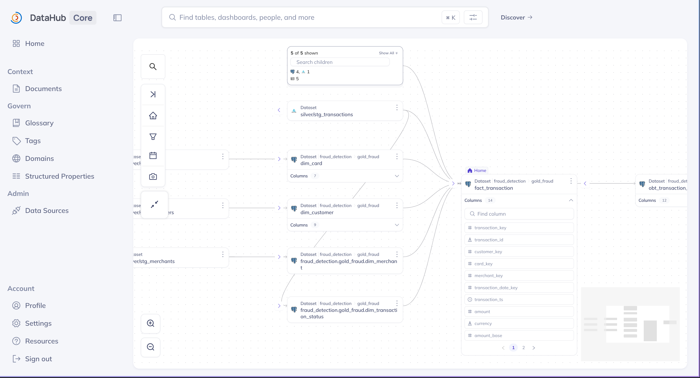

# 🗂️ DataHub Setup

> Deploy **DataHub** for data discovery and **lineage** — automatically captures the Bronze → Silver → Gold → Feature graph emitted by the Airflow lineage plugin.

<table>
<tr><th>Component</th><th>Version</th><th>Helm Chart</th></tr>
<tr><td>DataHub</td><td>v1.6.0</td><td><code>datahub/datahub 1.0.0</code></td></tr>
<tr><td>OpenSearch / Kafka / MySQL</td><td>bundled</td><td><code>datahub/datahub-prerequisites 0.3.0</code></td></tr>
</table>

> [!NOTE]
> **Prerequisites:** Kind cluster running. The DataHub lineage plugin (`acryl-datahub` + `acryl-datahub-airflow-plugin`) is baked into the Airflow image via `infra/docker/airflow/requirements-governance.txt` — no manual install.
>
> ⚠️ DataHub is heavy (OpenSearch + Kafka + MySQL + GMS). Check free RAM (`free -h`) before installing — budget ~3 GiB for the core on top of the prerequisites.

---

## 🚀 Setup

### 1. Prerequisites (OpenSearch + Kafka + MySQL)

```bash
helm repo add datahub https://helm.datahubproject.io/ && helm repo update
kubectl create namespace datahub

kubectl create secret generic mysql-secrets --namespace datahub \
  --from-literal=mysql-root-password=datahub \
  --from-literal=mysql-password=datahub \
  --from-literal=mysql-replication-password=datahub

helm install prerequisites datahub/datahub-prerequisites \
  --namespace datahub --values infra/helm/datahub/prerequisites-values.yaml --timeout 10m
```

> [!IMPORTANT]
> `opensearch.persistence.enabled: true` is required — without a PVC, GMS crashes on the next restart with `index_not_found_exception`.

Wait for 3 pods Ready: `opensearch-cluster-master-0`, `prerequisites-kafka-controller-0`, `prerequisites-mysql-0`.

### 2. DataHub core

```bash
kubectl create secret generic datahub-mysql-secrets --namespace datahub \
  --from-literal=mysql-password=datahub

helm install datahub datahub/datahub \
  --namespace datahub --values infra/helm/datahub/datahub-values.yaml --timeout 15m
```

Wait (~5 min) — `datahub-datahub-gms` + `datahub-datahub-frontend` Running, `datahub-system-update-*` Completed. (The mae/mce consumers are embedded in GMS.)

---

## 🔗 Auto-lineage via the Airflow plugin

Lineage is emitted **automatically** after each Airflow task — the v2 plugin reads `inlets`/`outlets` on `@task(...)` and pushes dataset lineage to GMS. Config (in `infra/helm/airflow/values.yaml`):

```yaml
env:
  - name: AIRFLOW__LINEAGE__BACKEND
    value: "datahub_provider.lineage.datahub.DatahubLineageBackend"
  - name: AIRFLOW_CONN_DATAHUB_REST_DEFAULT
    value: "http://datahub-datahub-gms.datahub.svc.cluster.local:8080"
```

---

## ✅ Verify

```bash
kubectl port-forward svc/datahub-datahub-frontend 9002:9002 -n datahub
# http://localhost:9002  (datahub / datahub)
```

After any DAG runs, search a dataset (e.g. `feat_customer_unified`) → **Lineage** tab to see the upstream graph:

<p align="center">
  
  <br/><em>DataHub — Bronze → Silver → Gold → Feature lineage, auto-emitted by the Airflow plugin.</em>
</p>

> [!NOTE]
> Lineage populates only after pipelines run. Until then DataHub is empty.

---

## 🧹 Teardown

```bash
helm uninstall datahub --namespace datahub
helm uninstall prerequisites --namespace datahub
kubectl delete namespace datahub
```
