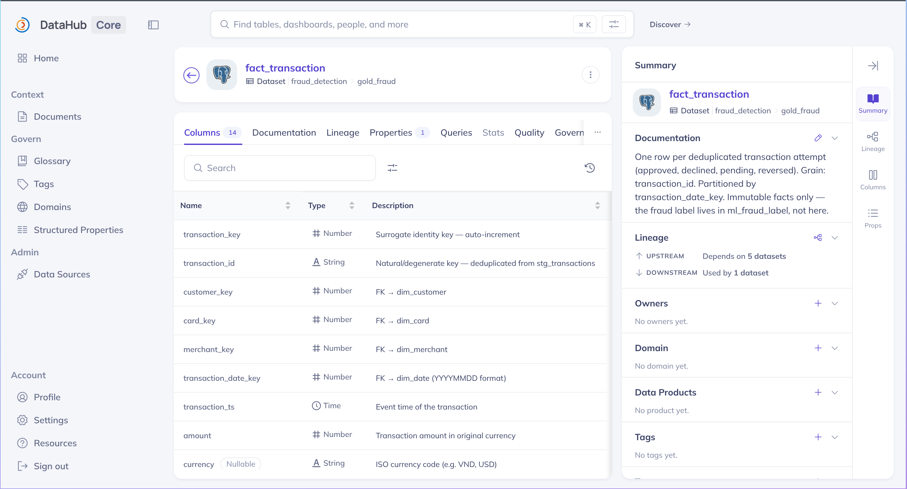

# 🛡️ Data Governance Setup

> Gold-layer governance with **Great Expectations (GE-native)**: per-column rules + **data contracts** + descriptions, surfaced via **GE Data Docs** (HTML validation report) and **DataHub** (catalog: description + contract + assertions).

| Component | Role | File |
|---|---|---|
| GE ExpectationSuites | Single source of truth: per-column rules + descriptions | `src/pipelines/governance/suites.py` |
| GE runner | Validate DataFrame → Data Docs, classify critical/warn | `src/pipelines/governance/ge_validate.py` |
| Quality gate (DAG) | Block pipeline on critical violation | `dags/dag_batch_gold.py` (`validate_contracts`) |
| Standalone validator | Validate Postgres + build Data Docs | `scripts/validate/validate_contracts.py` |
| DataHub emitter | Push description + contract + assertions | `scripts/governance/emit_contracts.py` |

```
suites.py  ← SINGLE SOURCE OF TRUTH (6 Gold tables: per-column type/nullable/description/checks)
   ├──▶ GE Checkpoint ──▶ Data Docs (HTML, per-column pass/fail)
   │           └──▶ raise on critical fail   ← quality gate in batch_gold DAG
   └──▶ DataHub (description + DataContract + Assertions)   ← catalog
```

> [!NOTE]
> **Severity** (in each expectation's `meta`): `critical` (schema / `not_null` / `unique`) → **fail pipeline**; `warn` (`accepted_values` / `value_between`) → log only.
> **6 contracted tables:** `fact_transaction`, `dim_customer`, `dim_card`, `obt_transaction_fraud_summary`, `feat_customer_unified`, `ml_fraud_training`.

---

## 🚀 Usage

### 1. Automatic quality gate (in-pipeline)

The `validate_contracts` task at the end of `batch_gold` validates `dim_customer / dim_card / fact_transaction / obt_transaction_fraud_summary` after the Gold load; a **critical** violation fails the task and blocks downstream. `ml_fraud_training` is validated inside `train.py` before training. No manual action — just run the DAG.

### 2. Build Data Docs (standalone)

The HTML report showing **per-column validation** — used for evidence.

```bash
kubectl port-forward svc/fraud-postgres-postgresql -n fraud-infra 15432:5432 &
python scripts/validate/validate_contracts.py
# → Data Docs (per-column results): file:///.../gx_project/gx/uncommitted/data_docs/local_site/index.html
```

Open that file — each table shows every expectation with ✅/❌, observed value, and unexpected-row count:

<p align="center">
  
  <br/><em>GE Data Docs — per-column data-contract results (type, not-null, accepted-values, ranges) per Gold table.</em>
</p>

### 3. Push contracts to DataHub (catalog)

```bash
kubectl port-forward svc/datahub-datahub-gms 8080:8080 -n datahub &
python scripts/governance/emit_contracts.py
```

DataHub (`http://localhost:9002`) → each Gold table: **Schema** (column descriptions), **Assertions** (per-column rules), **Contracts** (DataContract).

---

## ➕ Add / edit a contract

Edit `src/pipelines/governance/suites.py` — add a `Column(...)` to the right `TableSpec`. Validation, Data Docs, and DataHub all update from this single source.

```python
Column("new_col", "numeric", "Column description", nullable=False, value_between=(0, 100))
```

> [!TIP]
> Legacy `contracts/*.yaml` are **replaced** by `suites.py` (GE-native) — kept for reference only, no longer read by code.

---

## 🧹 Teardown

```bash
rm -rf gx_project/        # local GE project + Data Docs
```
