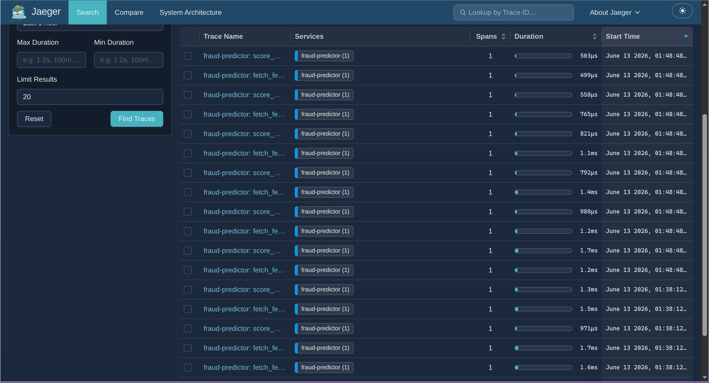

# 🔭 Jaeger Setup

> Deploy **Jaeger** (all-in-one, in-memory) for distributed tracing of the inference service — measure per-step latency: `fetch_features` (DB lookup) vs `score_model` (XGBoost inference).

<table>
<tr><th>Component</th><th>Version</th><th>Helm Chart</th></tr>
<tr><td>Jaeger all-in-one</td><td><b>1.58</b></td><td><code>jaegertracing/jaeger</code></td></tr>
<tr><td>Storage</td><td>in-memory (50k traces)</td><td>—</td></tr>
</table>

> [!NOTE]
> **Prerequisites:** Kind cluster + namespace `fraud-infra`. The inference service (KServe custom model) is instrumented with OpenTelemetry (OTLP gRPC exporter) emitting `fetch_features` / `score_model` spans.

---

## 🚀 Setup

### 1. Deploy Jaeger

```bash
helm repo add jaegertracing https://jaegertracing.github.io/helm-charts && helm repo update
helm install jaeger jaegertracing/jaeger --namespace fraud-infra --values infra/helm/jaeger/values.yaml
kubectl get pods -n fraud-infra | grep jaeger   # jaeger-xxx  1/1  Running
```

> [!NOTE]
> **all-in-one** bundles collector + query + agent in one pod (no Cassandra/ES). Traces are kept in memory (max 50k, lost on restart — fine for dev). One service `jaeger` exposes **both** OTLP (`:4317`) and the UI/query API (`:16686`) — there is no separate `jaeger-collector`/`jaeger-query`.

### 2. Point inference at Jaeger

`infra/k8s/fraud-inference.yaml` already sets the OTLP endpoint:

```
OTEL_EXPORTER_OTLP_ENDPOINT=http://jaeger.fraud-infra.svc.cluster.local:4317
```

> [!TIP]
> The Jaeger **service name is `fraud-predictor`** (the server sets the OTel `Resource` service name = `MODEL_NAME`, not via `OTEL_SERVICE_NAME`). If the predictor started before Jaeger, the OTLP exporter retries — traces appear on the next request, no restart needed.

---

## ✅ Verify

```bash
kubectl port-forward svc/jaeger -n fraud-infra 16686:16686
# http://localhost:16686 → Service: fraud-predictor → Find Traces
```

Or via the query API:

```bash
curl -s "http://jaeger.fraud-infra.svc.cluster.local:16686/api/services"
# {"data":["fraud-predictor"],...}
curl -s "http://jaeger.fraud-infra.svc.cluster.local:16686/api/traces?service=fraud-predictor&limit=5" \
  | python3 -c "import sys,json;d=json.load(sys.stdin)['data'];print('traces:',len(d));print(sorted({s['operationName'] for t in d for s in t['spans']}))"
# traces: 5
# ['fetch_features', 'score_model']
```

<p align="center">
  
  <br/><em>Jaeger trace — per-request breakdown of <code>fetch_features</code> (DB) vs <code>score_model</code> (XGBoost).</em>
</p>

---

## 🧹 Teardown

```bash
helm uninstall jaeger --namespace fraud-infra
```
