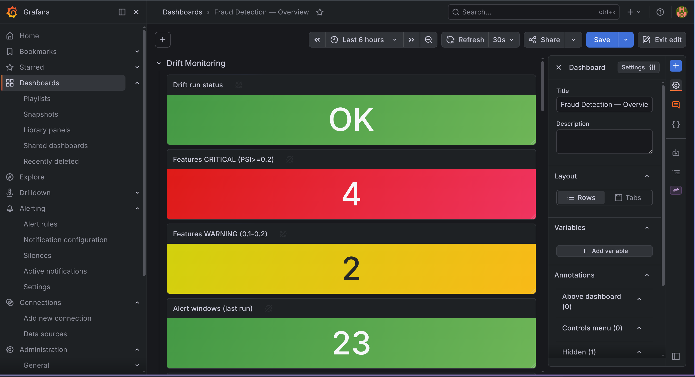
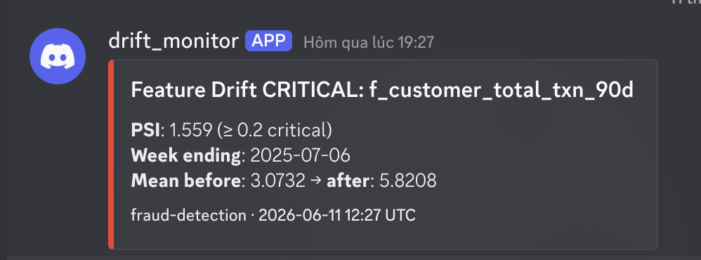
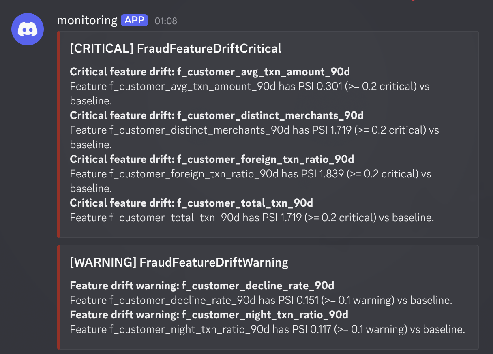

# 📊 Monitoring Setup

> Deploy the **observability core** — Prometheus, Pushgateway, Grafana, and Alertmanager — via the kube-prometheus-stack. Pipeline metrics land in Pushgateway; the inference service is scraped via a ServiceMonitor; drift alerts route to Discord.

<table>
<tr><th>Component</th><th>Version</th><th>Helm Chart</th></tr>
<tr><td>Prometheus</td><td>3.4.0</td><td><code>prometheus-community/kube-prometheus-stack 85.2.0</code></td></tr>
<tr><td>Grafana</td><td>13.x</td><td>(subchart)</td></tr>
<tr><td>Alertmanager</td><td>0.32.x</td><td>(subchart)</td></tr>
<tr><td>Pushgateway</td><td>v1.10.0</td><td><code>infra/k8s/pushgateway.yaml</code></td></tr>
</table>

> [!NOTE]
> **Prerequisites:** `kubectl` + `helm`, and a running Kind cluster. Namespace `monitoring`.

---

## 🚀 Setup

### 1. Namespace + repo

```bash
kubectl create namespace monitoring
helm repo add prometheus-community https://prometheus-community.github.io/helm-charts
helm repo update
```

### 2. Pushgateway — sink for short-lived batch-job metrics

```bash
kubectl apply -f infra/k8s/pushgateway.yaml
kubectl get pods -n monitoring -l app=pushgateway   # pushgateway-xxx  Running
```

### 3. kube-prometheus-stack

```bash
helm upgrade --install kube-prom prometheus-community/kube-prometheus-stack \
  --namespace monitoring --version 85.2.0 \
  -f infra/helm/monitoring/values.yaml --timeout 10m
```

Wait for all pods Running (~3 min for Grafana):

```
alertmanager-...-0                       2/2  Running
kube-prom-grafana-xxx                    3/3  Running
kube-prom-kube-prometheus-operator-xxx   1/1  Running
prometheus-...-0                         2/2  Running
pushgateway-xxx                          1/1  Running
```

---

## ✅ Verify

```bash
kubectl port-forward svc/kube-prom-kube-prometheus-prometheus -n monitoring 9090:9090
# http://localhost:9090 → Status → Targets
```

Scrape targets that should be **UP**: `airflow-statsd`, `minio`, `pushgateway`, and `fraud-inference-metrics` (appears after the Phase-13 ServiceMonitor is applied; it carries label `release: kube-prom`).

> [!NOTE]
> 4 targets report **down** on Kind — `kube-controller-manager`, `kube-etcd`, `kube-proxy`, `kube-scheduler` bind to `127.0.0.1` and aren't scrapable from a pod. This is expected.

### Grafana

```bash
kubectl port-forward svc/kube-prom-grafana -n monitoring 3000:80
# http://localhost:3000  (admin / fraud-grafana-2025)
```

The `Fraud Detection — Overview` dashboard (auto-loaded from `infra/k8s/grafana-fraud-dashboard.yaml`) shows drift PSI, inference latency, and model quality:

<p align="center">
  
  <br/><em>Grafana — drift PSI per feature, inference p50/p95/p99 latency, and model PR-AUC/F1.</em>
</p>

---

## 🔔 Drift alerts → Discord

Drift alerting is **rule-based** (no code): the `fraud-drift-alerts` PrometheusRule fires on PSI thresholds and Alertmanager routes `category: drift` to Discord via native `discord_configs` (see [governance-setup.md](governance-setup.md) and `infra/k8s/fraud-drift-alerts.yaml`).

<p align="center">
  
  
  <br/><em>Feature-drift alert firing in Prometheus → delivered to Discord.</em>
</p>

---

## 🔄 Update values

```bash
helm upgrade kube-prom prometheus-community/kube-prometheus-stack \
  --namespace monitoring --version 85.2.0 \
  -f infra/helm/monitoring/values.yaml --timeout 10m
```
